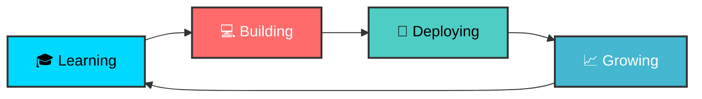

# 🚀 Sufardi Madoa | Full-Stack Developer

<div align="center">
  
</div>

<div align="center">
  
</div>

---

## 🌟 About Me

> **"Code is like humor. When you have to explain it, it's bad."** – Cory House

```javascript
const sufardi = {
  name: "Sufardi Madoa",
  role: "Full-Stack Developer & Assistant Lecturer",
  location: "Indonesia 🇮🇩",
  education: "Computer Science Student",
  passion: ["Web Development", "Teaching", "Learning New Tech"],
  currentFocus: "Building amazing web experiences",
  availableFor: "Internship & Job Opportunities",
  motto: "Never stop learning! 🚀"
};
```

<div align="center">
  
[](https://sufardimadoa.vercel.app)
[](https://read.cv/sufardimadoa)
[](https://www.linkedin.com/in/sufardi-madoa-116a56295)

</div>

---

## 🛠️ Tech Arsenal

<div align="center">

### 🎨 Frontend Magic


### 🎨 Styling & Design


### ⚙️ Backend Power


### 🗄️ Database & Others


</div>

---

## 📊 GitHub Analytics

<div align="center">
  
  
</div>

<div align="center">
  
</div>

---

## 🎯 Current Focus

<div align="center">



</div>

- 🔥 **Mastering**: React.js & Next.js ecosystem
- 🌱 **Currently Learning**: Advanced Node.js & System Design
- 🎯 **Goal 2024**: Land a great developer role & contribute to open source
- 💡 **Teaching**: Java programming to fellow students

---

## 🏆 Achievements & Highlights

<div align="center">

| 🎓 **Academic** | 💼 **Professional** | 🌟 **Personal** |
|:---:|:---:|:---:|
| Computer Science Student | Assistant Lecturer | Self-taught Developer |
| Java Programming Tutor | Web Development Focus | Continuous Learner |
| Active in Research | Open for Opportunities | Tech Enthusiast |

</div>

---

## 🤝 Let's Connect!

<div align="center">
  
**"Great things in business are never done by one person; they're done by a team of people."**

[](mailto:your.email@example.com)
[](https://www.linkedin.com/in/sufardi-madoa-116a56295)
[](https://sufardimadoa.vercel.app)
[](https://read.cv/sufardimadoa)

</div>

---

<div align="center">
  
</div>

<div align="center">
  <sub>Built with ❤️ by Sufardi Madoa</sub>
</div>
